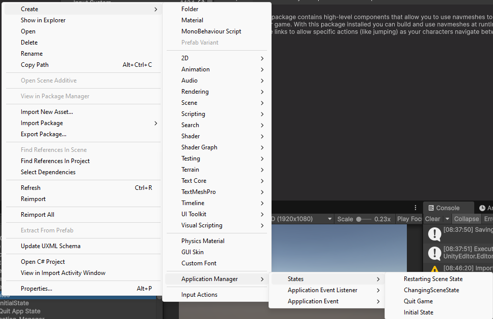
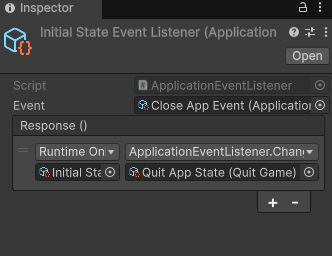
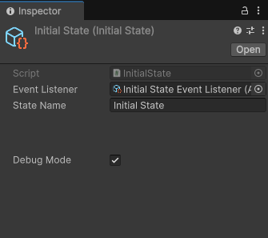
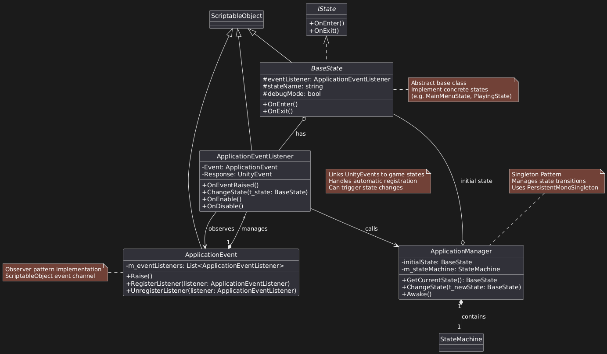

# Application Manager

A robust Unity package for efficient game state management using Scriptable Objects and a State Machine pattern.

Managing game states (e.g., Main Menu, Gameplay, Pause, Game Over) usually involves enums and cumbersome switch
statements, leading to maintainability issues in large projects. This package simplifies state management by leveraging
Unity's Scriptable Objects, providing an organized and scalable solution.

### Traditional Approach to Game State Management

Developers often manage game states using enums and switch statements, which can become unwieldy as projects grow. A
typical implementation might look like this:

```csharp
public void ChangeGameState(GameState newState) {
    if (m_gameState == newState) {
        return;
    }
    m_gameState = newState;
    switch (m_gameState) {
        case GameState.None:
            break;
        case GameState.LoadMainMenu:
            LoadMenu();
            break;
        case GameState.MainMenu:
            break;
        case GameState.LoadLevel:
            LoadLevel();
            break;
        case GameState.Playing:
            break;
        case GameState.RestartLevel:
            RestartLevel();
            break;
        case GameState.GameOver:
            break;
        case GameState.Credits:
            break;
        case GameState.QuitGame:
            QuitGame();
            break;
        default:
            throw new UnityException("Invalid Game State");
    }
}
```

While functional, this approach can lead to large, hard-to-maintain scripts as the number of game states increases. To
address this issue, the Application Manager utilizes the State Machine pattern in combination with Unity's Scriptable
Objects, promoting a more modular and maintainable architecture.

---
## Features

- Easy creation and management of game states and events through Scriptable Objects.

- Built-in support for common states (scene changes, quitting, restarting scenes).

- Extendable architecture for custom game state implementations.

- Debug mode to track state changes effectively.

---

## Installation

1. Open Unity's Package Manager.
2. Add the required dependency via Git URL: `https://github.com/UnityCommunity/UnitySingleton.git`
3. Add this package via Git URL: `https://github.com/lfeq/Improved-Game-Manager.git`
4. Done!

---

## Usage

1. Create a new State:
    - Right-click in the Project window → `Application Manager/States/[State]`



2. Create an EventListener:
    - Right-click in the Project window → `Application Manager/Application EventListeners/[EventListener]`
3. Create an Event:
    - Right-click in the Project window → `Application Manager/Application Events/[Event]`
4. Link Event and EventListener
    - Assign the Event to the EventListener's inspector.



5. Assign EventListener to State:
    - Assign the Event to the EventListener's inspector.



6. Assign EventListener to State:
    - Assign the Event to the EventListener's inspector.

---

## How It Works

The Application Manager leverages the State Machine pattern combined with Unity’s Scriptable Objects for flexible state
management:

- StateMachine: Handles transitioning between different states.

- BaseState: Defines abstract states as Scriptable Objects.

- Events & EventListeners: Trigger state transitions via UnityEvents.

- ApplicationManager: A singleton managing the current game state.

### Architecture Overview:

- Each State inherits from a base ScriptableObject class.

- Events trigger registered EventListeners when raised.

- EventListeners invoke state transition logic defined by UnityEvents.

- StateMachine manages current states and ensures proper transitions.

### Benefits:

- Clean separation of state logic.

- Easy state creation without modifying existing code.

- Enhanced debugging capabilities.

- Reduction of boilerplate and repetitive code.



---

## Contributing

We welcome your contributions to improve Application Manager! To contribute:

1. Fork the repository.

2. Create your feature branch (git checkout -b feature/YourFeatureName).

3. Commit your enhancements (git commit -m 'Describe your feature clearly').

4. Push to your branch (git push origin feature/YourFeatureName).

5. Submit a Pull Request detailing your changes.